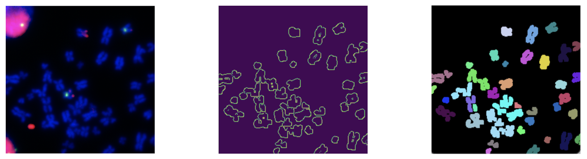
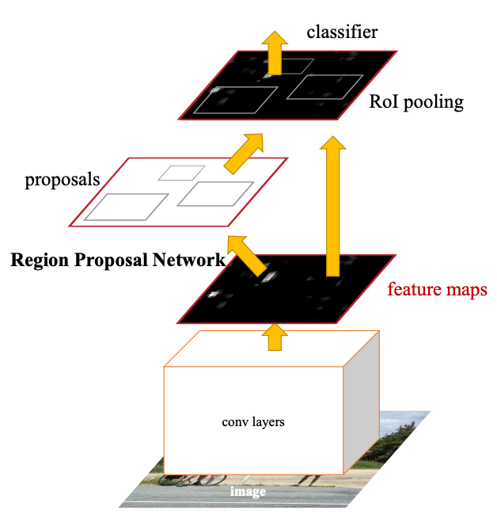
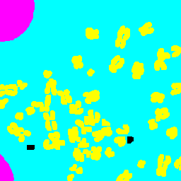
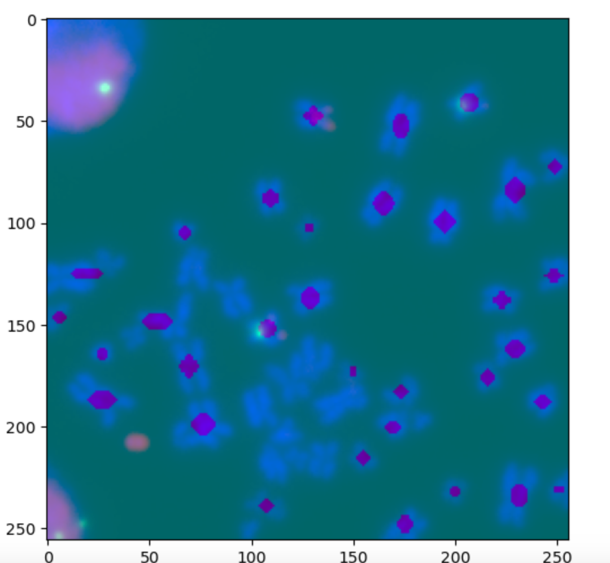
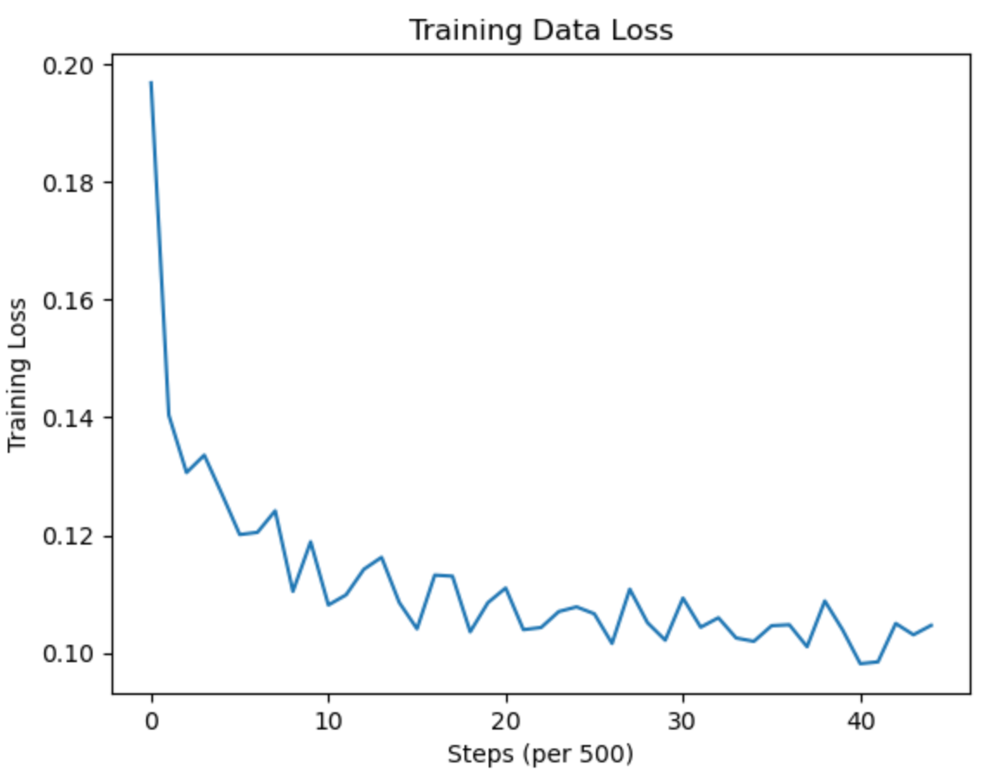
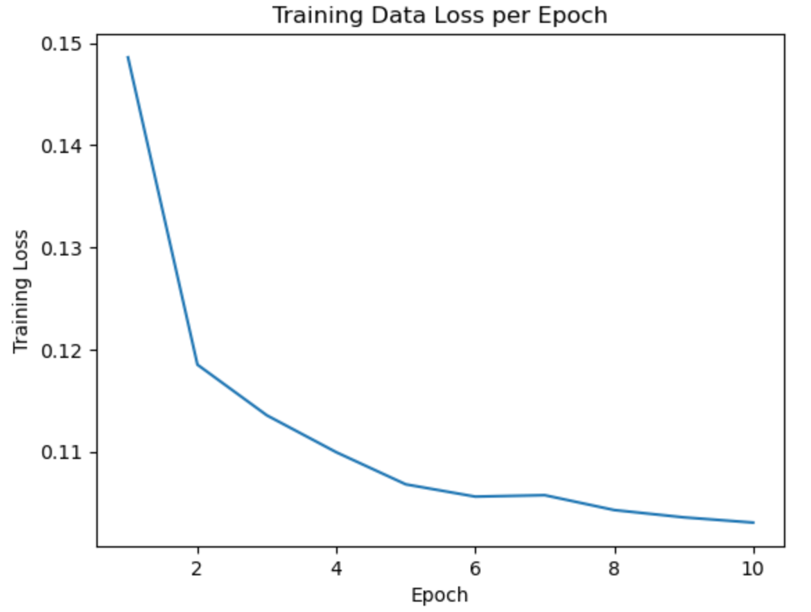
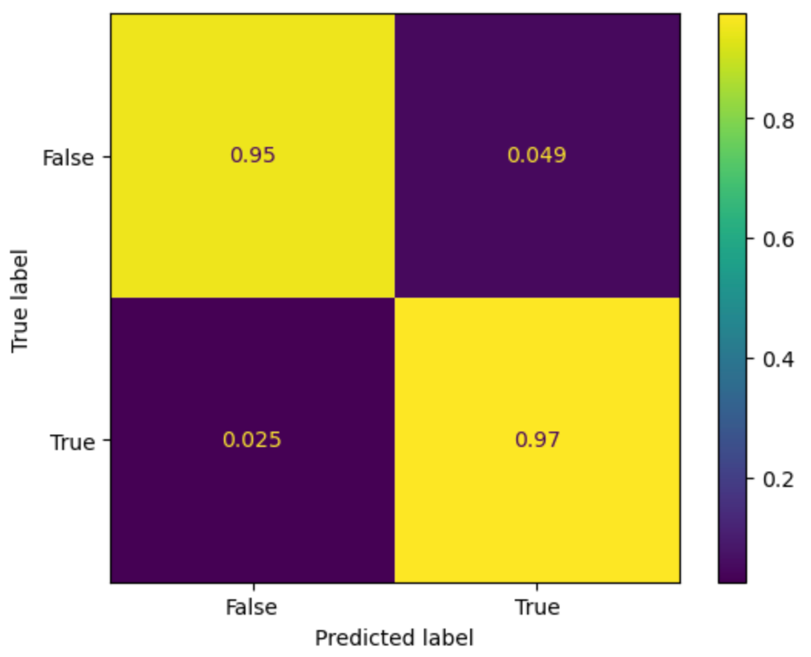

# **Clearer Views for Cancer Research: Upgrading Chromosome Analysis**
## Why should we care about chromosome analysis?
Cancer cells have been shown to have genetic mutations that lead to uncontrolled cell division that can often lead to the creation of tumors (ChemoMetec). This happens through oncogenes, a mutated gene that has the potential to turn cancerous, that is carried in extrachromosomal DNA, also known as ecDNA (ChemoMetec). This tells us that cell research is vital to the knowledge and understanding of cancer. The manual analyzing of cells, though, is tedious, time-consuming, and prone to human error. 

It’s important to count individual chromosomes because as new ones form, ecDNA also replicates which means that the copy number of oncogenes grows. It’s also vital to be able to identify if new chromosomes have been created because we can get a sense of whether chromosomes are duplicated or fragmented, giving us more information on cancer cells and their growth.

<figure>

    
    <figcaption> <strong>Processing</strong> 
    Starting with the original image, we can visualize contours of the chromsomes in the cell, then apply colors to be able to see which are connected.
    </figcaption>

 </figure>
    
## What does our project aim to do?
Our project aims to develop an imaging system designed to accurately identify and segment chromosomes within cell images. Recognizing the critical role that genetic mutations and extrachromosomal DNA (ecDNA) play in cancer development, our system will the the idea of instance segmentation and apply semantic segmentation to overcome the limitations of current methods.

### Instance vs. Semantic Segmentation
Semantic segmentation is what many previously developed models, like EcSeg, use to classify chromosomes. The fallback from semantic segmentation is that it works to identify the class of an object, but does not identify individual instances of the class. Instance segmentation works specifically to do this. It identifies individual instances of classes giving us the ability to count how many times an object is present in an image.

<figure>

    
    
    <figcaption> <strong>Figure 1</strong> In this example, semantic segmentation identifies the class of a person where instance    segmentation creates boundaries and identifies each person individually, allowing us to count how many are in the group (Folio3). This is the concept we’re using but instead, we’re making it a semantic segmentation problem, where we find the centers of the chromosomes and individually identify them that way. </figcaption>

<a href= "https://www.folio3.ai/blog/semantic-segmentation-vs-instance-segmentation/"> Image Source </a>
</figure>

## Methods
To study the link between ecDNA and chromosomes, we used publicly available images of cancer cells to train our models. We followed the Faster R-CNN architecture to create a model suitable for the task of segmentation (Faster R-CNN). We settled on the architecture of Faster R-CNN due to its high accuracy, something that is crucial for medical imaging tasks, and its use of feature maps, something we had pre-trained through the work of our mentor. 

<figure>
    

        
        <figcaption> <strong>Faster R-CNN Architecture</strong> 
        We utilized this architecture for our region proposal network (RPN).
        </figcaption>
    
 
    <a href= "https://arxiv.org/pdf/1506.01497.pdf"> Image Source </a>
</figure>

### Steps
1. Process images with UNET to generate feature maps of only chromsomes components. UNET comes from ecSeg.
    <figure>
    

        
    
 </figure>

1. Generate bounding boxes using connected components.
    <figure>
    

        
    
 </figure>

1. Generate anchor boxes and compare against connected component boxes to find valid anchor points and centers.

1. Sample 100 true centers and 100 false centers to train and optimize RPN using generated anchor points. True centers are identified when the anchor box and bounding box have an intersection over union (IoU) of greater than 0.6, otherwise they are false centers.

## Results
**Output**: Identified centers for chromsomes in the image.

<figure>

    
     <figcaption> <strong>Output Image</strong>
         The purple marks represent the valid chromosome centers our model predicted from our anchor boxes, while the blue shows the chromsomes of the original image. Some anchor boxes didn’t produce a valid center due to large overlapping chromosomes, producing large connected components.
     </figcaption>

 </figure>

- Using binary-cross entropy loss in the RPN model, the loss converged from approximately 0.18 to 0.11. The trend shows a sharp decline initially, which then converges.
- Over 10 epochs, our loss decreased from 0.14 to 0.11, indicating a consistent improvement in the model’s performance with each subsequent epoch.
- Our model demonstrated a high accuracy with 97% accuracy of true positives and 95% accuracy of true negatives. The false positives and false negatives are relatively low, at 4.9% and 2.5% respectively.
- Despite high accuracy, our anchor boxes missed larger connected components due to lower IOUs with their bounding boxes.

<figure>

    
    <figcaption> <strong>Loss per Step</strong> 
    The training loss overall decreases.
    </figcaption>

 </figure>

<figure>

    
    <figcaption> <strong>Training Loss per Epoch</strong> 
    The training loss per epoch confidently decreases over each epoch.
    </figcaption>

 </figure>

<figure>

    
    <figcaption> <strong>Confusion Matrix</strong> 
    Our model demonstrated a high accuracy with 97% accuracy of true positives and 95% accuracy of true negatives.
    </figcaption>

 </figure>

## Conclusion
While our model was able to predict with 97% true positive accuracy, 95% true negative accuracy, and a BCE loss of 0.11. These show confidence in prediciting chromsomes centers from the DAPI stained images. 

Further improvements could be made like having hand annotated true labels for better results, having the output give a chromosome count, and evalutating if there is a correlation between high chromsomes numbers and oncogenes in cancer cell images. Though there is still more work to be done, this is a step in the right direction and provides yet another foundation for researchers to build on. The exploration of chromosomes in cancerous cells is extremely important and this model provides an easy and faster way to do so. 

## References
1. <a align="center" href= "https://chemometec.com/industry/oncology/"> ChemoMetec (2023) </a>
2. <a align="center" href="https://www.folio3.ai/blog/semantic-segmentation-vs-instance-segmentation/"> Folio3 </a>
3. <a align="center" href="https://arxiv.org/pdf/1506.01497.pdf"> Faster R-CNN </a>
