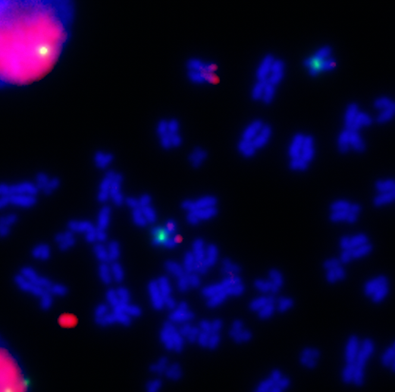
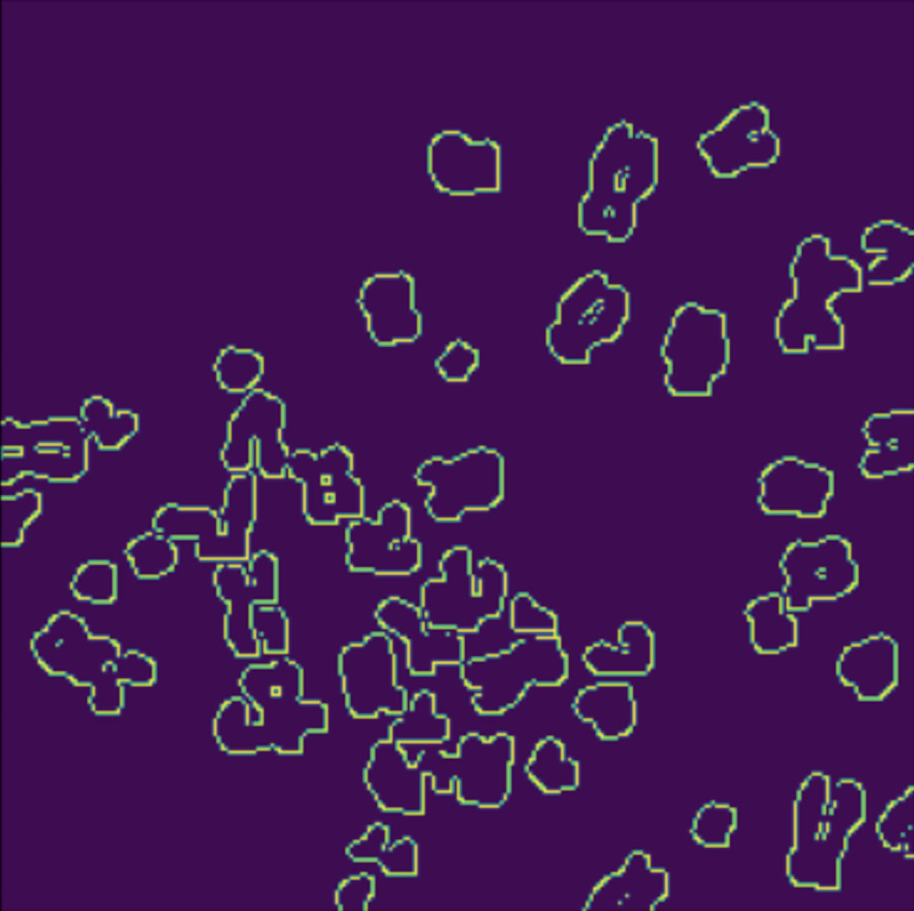

## Introduction
### Why should we care about chromosome analysis?
Cancer cells have been shown to have genetic mutations that lead to uncontrolled cell division that can often lead to the creation of tumors (ChemoMetec). This happens through oncogenes, a mutated gene that has the potential to turn cancerous, that is carried in extrachromosomal DNA, also known as ecDNA (ChemoMetec). This tells us that cell research is vital to the knowledge and understanding of cancer. The analyzing of cells, though, is often tedious, time-consuming, and prone to human error. 

It’s important to count individual chromosomes because as new ones form, ecDNA also replicates which means that the copy number of oncogenes grows. It’s also vital to be able to identify if new chromosomes have been created because we can get a sense of whether chromosomes are duplicated or fragmented, giving us more information on cancer cells and their growth.

<figure>

    

 </figure>

<figure>

    

 </figure>

<figure>

    

 </figure>
    
### What does our project aim to do?
Our project aims to develope an advanced imaging system designed to accurately identify, segment, and count chromosomes within cell images. Recognizing the critical role that genetic mutations and extrachromosomal DNA (ecDNA) play in cancer development, our system will leverage instance segmentation techniques to overcome the limitations of current methods.

## Methods
To study the link between ecDNA and chromosomes, we used publicly available images of cancer cells to train our models. These images, however, didn’t contain exclusively our cells of interest, metaphase cells, so we had to process the images to make them more applicable to our use case. To start, we process our images into single channel grayscale images that make it easier to perform image calculations on. From there, we, using a Regional Convolutional Neural Network, segment out the areas of the image which we are not interested in, as well as take crops of the broader regions of the chromosomes that we will process. Finally, we run the newly acquired images, the regions with the chromosomes, through a segmentation script that is able to identify overlapping regions while remaining accurate on areas where only one chromosome is present.

### Steps
 1. Process images with UNET to generate feature maps.
<figure>

    

 </figure>
 3. Generate bounding boxes using connected components.
 <figure>

    

 </figure>
 4. Generate anchor boxes and compare against connected component boxes to find valid anchor points and centers.
 5. Sample 100 true centers and 100 false centers to train and optimize RPN using generated anchor points.
<figure>

    

 </figure>

### Instance vs. Semantic Segmentation
Semantic segmentation is what many previously developed models, like EcSeg, use to classify chromosomes. The fallback from semantic segmentation is that it works to identify the class of an object, but does not identify individual instances of the class. Instance segmentation works specifically to do this. It identifies individual instances of classes giving us the ability to count how many times an object is present in an image.

<figure>

    
    
    <figcaption> <strong>Figure 1</strong> In this example, semantic segmentation identifies the class of a person where instance    segmentation creates boundaries and identifies each person individually, allowing us to count how many are in the group (Folio3). This same concept would be applied to nuclei clusters where each nucleus would be individually outlined and identified, allowing us to count how many there are. </figcaption>

<a href= "https://www.folio3.ai/blog/semantic-segmentation-vs-instance-segmentation/"> Image Source </a>
</figure>

## Results
- Using binary-cross entropy loss in the RPN model, the loss converged from approximately 0.18 to 0.11. The trend shows a sharp decline initially, which then converges.
- Over 10 epochs, our loss decreased from 0.14 to 0.11, indicating a consistent improvement in the model’s performance with each subsequent epoch.
- Our model demonstrated a high accuracy with 97% accuracy of true positives and 95% accuracy of true negatives. The false positives and false negatives are relatively low, at 4.9% and 2.5% respectively.
- Despite high accuracy, our anchor boxes missed larger connected components due to lower IOUs with their bounding boxes.

<figure>

    

 </figure>

  

    
  

  

    
  

<figure>

    

 </figure>

## Conclusion
While our model was able to predict with over 97% accuracy, the binary cross entropy loss was greater at 11.37%. This means that, while our model was accurate at predicting centers, it wasn’t absolutely confident while doing so.

## References
1. <a align="center" href= "https://chemometec.com/industry/oncology/"> ChemoMetec (2023) </a>
2. <a align="center" href="https://www.folio3.ai/blog/semantic-segmentation-vs-instance-segmentation/"> Folio3 </a>
